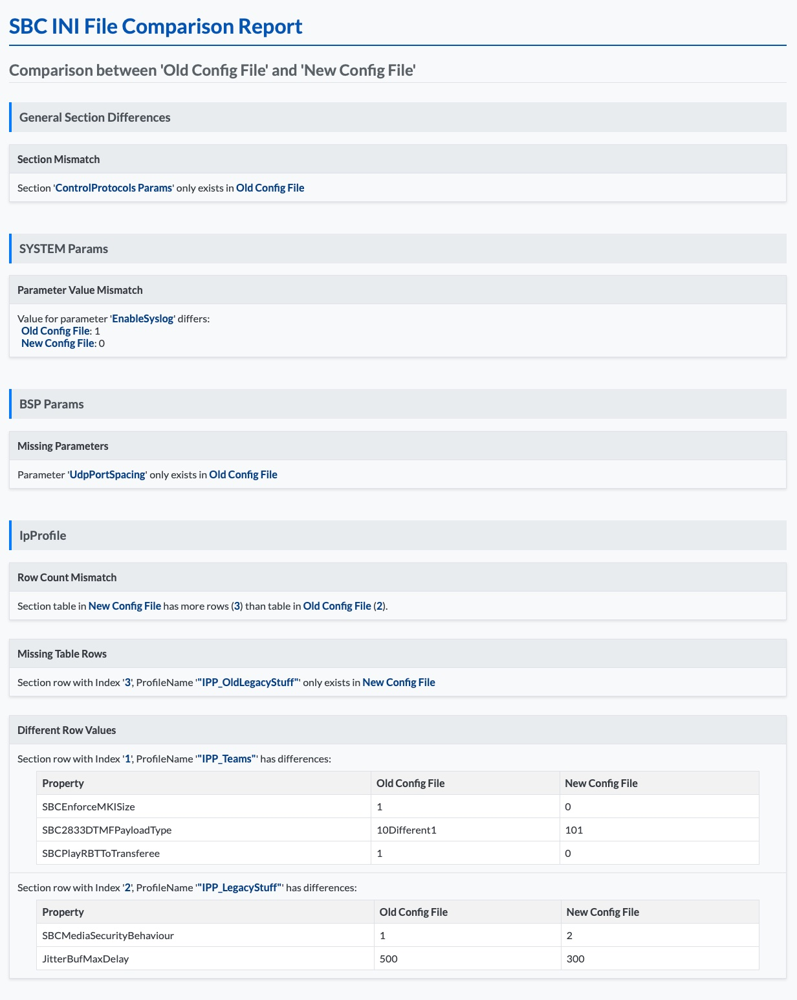

# AudioCodes SBC INI File Comparison Tool


A PowerShell script for analyzing and comparing AudioCodes Session Border Controller (SBC) INI configuration files.

## 🔍 The Challenge

If you've worked with AudioCodes SBCs, you know comparing INI configuration files can be challenging:

- Files packed with sections like IP Profiles containing endless strings of 0s, 1s, and default values
- Manual reviews often miss subtle parameter changes that could lead to issues
- Multiple SBCs in "active-active-cluster" setups require careful synchronization
- Identifying what's changed, missing, or potentially problematic is time-consuming

## 🛠️ Solution

This script simplifies comparing AudioCodes SBC INI files by:

- Parsing the structured format
- Identifying variances in sections like IpProfile or SIPInterface
- Generating a clean HTML report highlighting differences

### Features

- **SBC-Focused Comparison:**
  - General settings
  - Table-based settings (IP Profiles, SIP Interfaces, etc.)
  - Highlights drifted settings and missing rows

- **Clear HTML Report:**
  - Customizable displayname for each SBC
  - Section-by-section comparison
  - Color-highlighted differences for easy identification

## 📋 Usage

```powershell
.\Compare-ACSBCIniFiles.ps1  `
    -SBCIniFilePath1 "C:\Temp\SBC1.ini"  `
    -SBCName1 "PROD-SBC" `
    -SBCIniFilePath2 "C:\Temp\SBC2.ini" `
    -SBCName2 "DR-SBC" `
    -ReportFilePath "C:\Temp\SBC-Comparison.html"
```

## 📊 Sample Output

The script generates an HTML report highlighting all differences found between the INI files:



## ⚙️ Parameters

| Parameter | Description |
|-----------|-------------|
| SBCIniFilePath1 | Path to first INI file |
| SBCName1 | Display name for first SBC (used in the report) |
| SBCIniFilePath2 | Path to second INI file |
| SBCName2 | Display name for second SBC (used in the report) |
| ReportFilePath | Path where the HTML report should be saved |

## 🚀 Getting Started

1. Clone this repository
2. Navigate to the script folder
3. Execute the script with your SBC INI files
4. Open the generated HTML report in your browser

## ⚠️ Current Limitations

The script currently has difficulty handling mismatched indexes containing the same content. For example, if both INI files have an IP Profile named "Teams" with identical settings, but on the first SBC it's listed as index 0 and on the second as index 1, the script will show them as different.


---

<sub>*Created with ❤️ for AudioCodes SBC admins*</sub>
